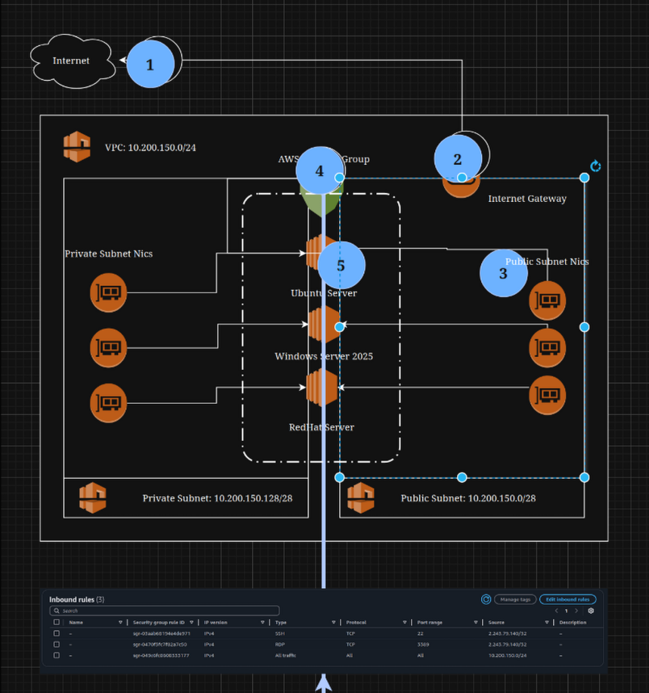
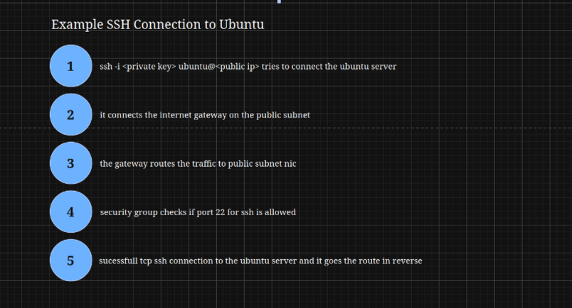

## Technical Network Diagram 

[Back to Week Overview](../README.md) 
[Back to Main](../../README.md)

I decided to draw the aws cloud environment architectural network diagram for environment from [Cloud Dev Setup](../cloud-env-setup/README.md) 
as conceptional diagram cause we use it through entire course.

### AWS Networking Fundamentals Network Diagramm 

