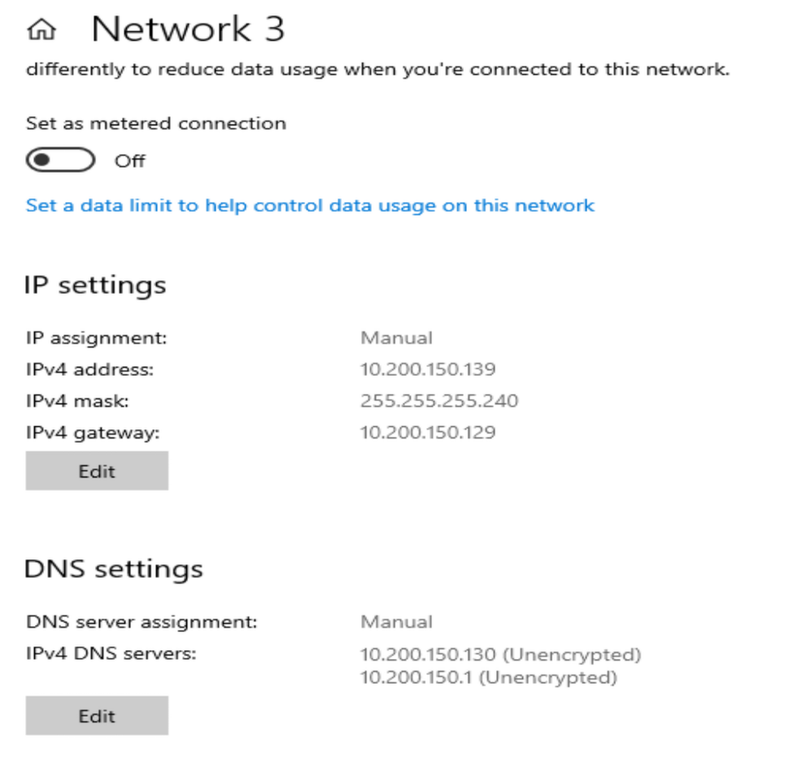
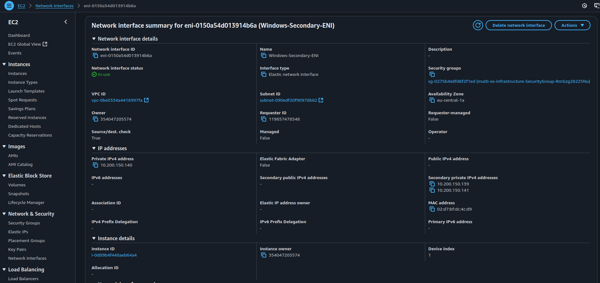
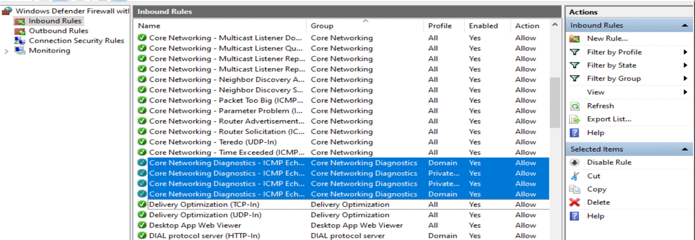

# IP Address Management Journal Contents 

[Back to Week Overview](../README.md)<br/>
[Back to Main](../../README.md)

* We will cover in this part:
    * [Windows Address Management](#windows-server-2025)
    * [Red Hat Address Management]()
    * [Ubuntu Address Management](#ubuntu-server)
    * [Install Virtual Microsoft Server machine into azure with Iac like bicep / arm or terraform](../../../projects/ipaddressmanagement-azure/Journal.md)


## Windows Server 2025
start with widnows server. First i need to change the language and setup my mother language german.
After that i check for the ipadresses with my favorite commandline tool powershell

```powershell
Get-NetAdapter | ForEach-Object {
    $adapter = $_
    Get-NetIPAddress -InterfaceIndex $adapter.ifIndex | ForEach-Object {
        [PSCustomObject]@{
            Name      = $adapter.Name
            ifIndex   = $_.InterfaceIndex
            IPAddress = $_.IPAddress
        }
    }
}
Name       ifIndex IPAddress
----       ------- ---------
Ethernet 3       8 fe80::31f9:a844:8896:c14e%8
Ethernet 3       8 10.200.150.9
Ethernet 4      12 fe80::b4b3:7eb7:87bb:698%12
Ethernet 4      12 10.200.150.140
```

Next step ip to find the ubuntu and red hat machine and make a ping

```bash
## ubuntu 
ubuntu@ip-10-200-150-8:~$ ip a
1: lo: <LOOPBACK,UP,LOWER_UP> mtu 65536 qdisc noqueue state UNKNOWN group default qlen 1000
    link/loopback 00:00:00:00:00:00 brd 00:00:00:00:00:00
    inet 127.0.0.1/8 scope host lo
       valid_lft forever preferred_lft forever
    inet6 ::1/128 scope host noprefixroute 
       valid_lft forever preferred_lft forever
2: enX0: <BROADCAST,MULTICAST,UP,LOWER_UP> mtu 9001 qdisc mq state UP group default qlen 1000
    link/ether 02:e4:84:ea:4d:4d brd ff:ff:ff:ff:ff:ff
    inet 10.200.150.8/28 metric 100 brd 10.200.150.15 scope global dynamic enX0
       valid_lft 1925sec preferred_lft 1925sec
    inet6 fe80::e4:84ff:feea:4d4d/64 scope link 
       valid_lft forever preferred_lft forever
3: enX1: <BROADCAST,MULTICAST,UP,LOWER_UP> mtu 9001 qdisc mq state UP group default qlen 1000
    link/ether 02:85:0d:0e:ce:6b brd ff:ff:ff:ff:ff:ff
    inet 10.200.150.142/28 brd 10.200.150.143 scope global dynamic enX1
       valid_lft 1928sec preferred_lft 1478sec
    inet6 fe80::85:dff:fe0e:ce6b/64 scope link 
       valid_lft forever preferred_lft forever

## red hat 
[ec2-user@ip-10-200-150-7 ~]$ ip a
1: lo: <LOOPBACK,UP,LOWER_UP> mtu 65536 qdisc noqueue state UNKNOWN group default qlen 1000
    link/loopback 00:00:00:00:00:00 brd 00:00:00:00:00:00
    inet 127.0.0.1/8 scope host lo
       valid_lft forever preferred_lft forever
    inet6 ::1/128 scope host 
       valid_lft forever preferred_lft forever
2: eth0: <BROADCAST,MULTICAST,UP,LOWER_UP> mtu 9001 qdisc mq state UP group default qlen 1000
    link/ether 02:29:09:3a:e1:e3 brd ff:ff:ff:ff:ff:ff
    inet 10.200.150.7/28 brd 10.200.150.15 scope global dynamic eth0
       valid_lft 3487sec preferred_lft 3487sec
    inet6 fe80::29:9ff:fe3a:e1e3/64 scope link 
       valid_lft forever preferred_lft forever
3: eth1: <BROADCAST,MULTICAST,UP,LOWER_UP> mtu 9001 qdisc mq state UP group default qlen 1000
    link/ether 02:47:3c:70:26:01 brd ff:ff:ff:ff:ff:ff
    inet 10.200.150.138/28 brd 10.200.150.143 scope global dynamic eth1
       valid_lft 3493sec preferred_lft 3493sec
    inet6 fe80::47:3cff:fe70:2601/64 scope link 
       valid_lft forever preferred_lft forever
```

### Ping command connection check 
Ping works cause security group allows all packets within 10.200.150.0/24 subnet
```powershell
$ips = @(
    "10.200.150.7",
    "10.200.150.8",
    "10.200.150.138",
    "10.200.150.142"
)

foreach ($ip in $ips) {
    if (Test-Connection -ComputerName $ip -Count 1 -Quiet -TimeoutSeconds 1) {
        Write-Host "$ip is reachable" -ForegroundColor Green
    } else {
        Write-Host "$ip is not reachable" -ForegroundColor DarkGray
    }
}
10.200.150.7 is reachable
10.200.150.8 is reachable
10.200.150.138 is reachable
10.200.150.142 is reachable
```
### Static Private ip address 
Next  step was to assign a static ip address to the private network interface. 
i ran into an issue that after i assigned a static ip address the ping to the network failed.
After research i figured out that i also need to reassign the static address to the network interface in aws. 
I did it and it worked!




## Ubuntu Server

The first thing i wantes to do is again ping connection to windows server and red hat server
```bash
## windows
ubuntu@ip-10-200-150-8:~$ ping 10.200.150.139
PING 10.200.150.139 (10.200.150.139) 56(84) bytes of data.
64 bytes from 10.200.150.139: icmp_seq=49 ttl=128 time=0.847 ms
64 bytes from 10.200.150.139: icmp_seq=50 ttl=128 time=0.663 ms
64 bytes from 10.200.150.139: icmp_seq=51 ttl=128 time=0.861 ms
64 bytes from 10.200.150.139: icmp_seq=52 ttl=128 time=0.819 ms
64 bytes from 10.200.150.139: icmp_seq=53 ttl=128 time=0.680 ms
^C
--- 10.200.150.139 ping statistics ---
53 packets transmitted, 5 received, 90.566% packet loss, time 53250ms
rtt min/avg/max/mdev = 0.663/0.774/0.861/0.084 ms
## red hat 
ubuntu@ip-10-200-150-8:~$ ping 10.200.150.138
PING 10.200.150.138 (10.200.150.138) 56(84) bytes of data.
64 bytes from 10.200.150.138: icmp_seq=1 ttl=255 time=2.19 ms
64 bytes from 10.200.150.138: icmp_seq=2 ttl=255 time=1.15 ms
64 bytes from 10.200.150.138: icmp_seq=3 ttl=255 time=1.33 ms
^C
--- 10.200.150.138 ping statistics ---
3 packets transmitted, 3 received, 0% packet loss, time 2003ms
rtt min/avg/max/mdev = 1.154/1.555/2.186/0.451 ms
```

For the first time ping to windows it failed cause the firewall rule for echo request were not enabled by default. I enabled it and it worked!



### ip config and route for ubuntu server
```bash 
ubuntu@ip-10-200-150-8:~$ ip a
1: lo: <LOOPBACK,UP,LOWER_UP> mtu 65536 qdisc noqueue state UNKNOWN group default qlen 1000
    link/loopback 00:00:00:00:00:00 brd 00:00:00:00:00:00
    inet 127.0.0.1/8 scope host lo
       valid_lft forever preferred_lft forever
    inet6 ::1/128 scope host noprefixroute 
       valid_lft forever preferred_lft forever
2: enX0: <BROADCAST,MULTICAST,UP,LOWER_UP> mtu 9001 qdisc mq state UP group default qlen 1000
    link/ether 02:e4:84:ea:4d:4d brd ff:ff:ff:ff:ff:ff
    inet 10.200.150.8/28 metric 100 brd 10.200.150.15 scope global dynamic enX0
       valid_lft 3135sec preferred_lft 3135sec
    inet6 fe80::e4:84ff:feea:4d4d/64 scope link 
       valid_lft forever preferred_lft forever
3: enX1: <BROADCAST,MULTICAST,UP,LOWER_UP> mtu 9001 qdisc mq state UP group default qlen 1000
    link/ether 02:85:0d:0e:ce:6b brd ff:ff:ff:ff:ff:ff
    inet 10.200.150.142/28 metric 200 brd 10.200.150.143 scope global dynamic enX1
       valid_lft 3135sec preferred_lft 3135sec
    inet6 fe80::85:dff:fe0e:ce6b/64 scope link 
       valid_lft forever preferred_lft forever
ubuntu@ip-10-200-150-8:~$ ip route 
default via 10.200.150.1 dev enX0 proto dhcp src 10.200.150.8 metric 100 
default via 10.200.150.129 dev enX1 proto dhcp src 10.200.150.142 metric 200 
default via 10.200.150.129 dev enX1 proto dhcp src 10.200.150.142 metric 1003 mtu 9001 
10.200.150.0/28 dev enX0 proto kernel scope link src 10.200.150.8 metric 100 
10.200.150.1 dev enX0 proto dhcp scope link src 10.200.150.8 metric 100 
10.200.150.2 dev enX0 proto dhcp scope link src 10.200.150.8 metric 100 
10.200.150.2 via 10.200.150.129 dev enX1 proto dhcp src 10.200.150.142 metric 200 
10.200.150.128/28 dev enX1 proto dhcp scope link src 10.200.150.142 metric 1003 mtu 9001 
10.200.150.129 dev enX1 proto dhcp scope link src 10.200.150.142 metric 200 

## add second ip address to private interface after enabling in aws console
ubuntu@ip-10-200-150-8:~$ sudo ip addr add 10.200.150.141/28 dev enX1 
ubuntu@ip-10-200-150-8:~$ ip a
1: lo: <LOOPBACK,UP,LOWER_UP> mtu 65536 qdisc noqueue state UNKNOWN group default qlen 1000
    link/loopback 00:00:00:00:00:00 brd 00:00:00:00:00:00
    inet 127.0.0.1/8 scope host lo
       valid_lft forever preferred_lft forever
    inet6 ::1/128 scope host noprefixroute 
       valid_lft forever preferred_lft forever
2: enX0: <BROADCAST,MULTICAST,UP,LOWER_UP> mtu 9001 qdisc mq state UP group default qlen 1000
    link/ether 02:e4:84:ea:4d:4d brd ff:ff:ff:ff:ff:ff
    inet 10.200.150.8/28 metric 100 brd 10.200.150.15 scope global dynamic enX0
       valid_lft 3448sec preferred_lft 3448sec
    inet6 fe80::e4:84ff:feea:4d4d/64 scope link 
       valid_lft forever preferred_lft forever
3: enX1: <BROADCAST,MULTICAST,UP,LOWER_UP> mtu 9001 qdisc mq state UP group default qlen 1000
    link/ether 02:85:0d:0e:ce:6b brd ff:ff:ff:ff:ff:ff
    inet 10.200.150.142/28 metric 200 brd 10.200.150.143 scope global dynamic enX1
       valid_lft 3449sec preferred_lft 3449sec
    inet 10.200.150.141/28 scope global secondary enX1
       valid_lft forever preferred_lft forever
    inet6 fe80::85:dff:fe0e:ce6b/64 scope link 
       valid_lft forever preferred_lft forever
```

### Netplan in Ubuntu 

```bash 
## netplan cli 
You need to specify a command
usage: /usr/sbin/netplan  [-h] [--debug]  ...

Network configuration in YAML

options:
  -h, --help  show this help message and exit
  --debug     Enable debug messages

Available commands:
  
    help      Show this help message
    apply     Apply current netplan config to running system
    generate  Generate backend specific configuration files from /etc/netplan/*.yaml
    get       Get a setting by specifying a nested key like "ethernets.eth0.addresses", or "all"
    info      Show available features
    ip        Retrieve IP information from the system
    set       Add new setting by specifying a dotted key=value pair like ethernets.eth0.dhcp4=true
    rebind    Rebind SR-IOV virtual functions of given physical functions to their driver
    status    Query networking state of the running system
    try       Try to apply a new netplan config to running system, with automatic rollback
ubuntu@ip-10-200-150-8:~$ 

## netplan ip address status 
ubuntu@ip-10-200-150-8:~$ sudo netplan status
     Online state: online
    DNS Addresses: 127.0.0.53 (stub)
       DNS Search: eu-central-1.compute.internal

●  1: lo ethernet UNKNOWN/UP (unmanaged)
      MAC Address: 00:00:00:00:00:00
        Addresses: 127.0.0.1/8
                   ::1/128

●  2: enX0 ethernet UP (networkd: enX0)
      MAC Address: 02:e4:84:ea:4d:4d
        Addresses: 10.200.150.8/28 (dynamic, dhcp)
                   fe80::e4:84ff:feea:4d4d/64 (link)
    DNS Addresses: 10.200.150.2
       DNS Search: eu-central-1.compute.internal
           Routes: default via 10.200.150.1 from 10.200.150.8 metric 100 (dhcp)
                   10.200.150.0/28 from 10.200.150.8 metric 100 (link)
                   10.200.150.1 from 10.200.150.8 metric 100 (dhcp, link)
                   10.200.150.2 from 10.200.150.8 metric 100 (dhcp, link)
                   fe80::/64 metric 256

●  3: enX1 ethernet UP (networkd: enX1)
      MAC Address: 02:85:0d:0e:ce:6b
        Addresses: 10.200.150.142/28 (dynamic, dhcp)
                   10.200.150.141/28
                   fe80::85:dff:fe0e:ce6b/64 (link)
    DNS Addresses: 10.200.150.2
       DNS Search: eu-central-1.compute.internal
           Routes: default via 10.200.150.129 from 10.200.150.142 metric 200 (dhcp)
                   default via 10.200.150.129 from 10.200.150.142 metric 1003 (dhcp)
                   10.200.150.2 via 10.200.150.129 from 10.200.150.142 metric 200 (dhcp)
                   10.200.150.128/28 from 10.200.150.142 metric 1003 (dhcp, link)
                   10.200.150.129 from 10.200.150.142 metric 200 (dhcp, link)
                   fe80::/64 metric 256

## netplan config in sudo nano /etc/netplan/50-cloud-init.yaml
## configure static ip addresses 
network:
  version: 2
  ethernets:
    enX0:
      match:
        macaddress: "02:e4:84:ea:4d:4d"
      dhcp4: true
      dhcp4-overrides:
        route-metric: 100
      dhcp6: false
      set-name: "enX0"
    enX1:
      match:
        macaddress: "02:85:0d:0e:ce:6b"
      dhcp4: false 
      dhcp4-overrides:
        use-routes: true
        route-metric: 200
      dhcp6: false
      set-name: "enX1"
      addresses:
      - 10.200.150.141/28
      - 10.200.150.142/28
      nameservers:
        addresses:
        - 10.200.150.130
      routes:
      - table: 101
        to: "0.0.0.0/0"
        via: "10.200.150.129"
ubuntu@ip-10-200-150-8:~$ sudo netplan apply 
ubuntu@ip-10-200-150-8:~$ ip a
1: lo: <LOOPBACK,UP,LOWER_UP> mtu 65536 qdisc noqueue state UNKNOWN group default qlen 1000
    link/loopback 00:00:00:00:00:00 brd 00:00:00:00:00:00
    inet 127.0.0.1/8 scope host lo
       valid_lft forever preferred_lft forever
    inet6 ::1/128 scope host noprefixroute 
       valid_lft forever preferred_lft forever
2: enX0: <BROADCAST,MULTICAST,UP,LOWER_UP> mtu 9001 qdisc mq state UP group default qlen 1000
    link/ether 02:e4:84:ea:4d:4d brd ff:ff:ff:ff:ff:ff
    inet 10.200.150.8/28 metric 100 brd 10.200.150.15 scope global dynamic enX0
       valid_lft 3599sec preferred_lft 3599sec
    inet6 fe80::e4:84ff:feea:4d4d/64 scope link 
       valid_lft forever preferred_lft forever
3: enX1: <BROADCAST,MULTICAST,UP,LOWER_UP> mtu 9001 qdisc mq state UP group default qlen 1000
    link/ether 02:85:0d:0e:ce:6b brd ff:ff:ff:ff:ff:ff
    inet 10.200.150.141/28 brd 10.200.150.143 scope global enX1
       valid_lft forever preferred_lft forever
    inet 10.200.150.142/28 brd 10.200.150.143 scope global secondary enX1
       valid_lft forever preferred_lft forever
    inet6 fe80::85:dff:fe0e:ce6b/64 scope link 
       valid_lft forever preferred_lft forever
ubuntu@ip-10-200-150-8:~$ ping 10.200.150.138
PING 10.200.150.138 (10.200.150.138) 56(84) bytes of data.
64 bytes from 10.200.150.138: icmp_seq=1 ttl=255 time=1.14 ms
^C
--- 10.200.150.138 ping statistics ---
1 packets transmitted, 1 received, 0% packet loss, time 0ms
rtt min/avg/max/mdev = 1.137/1.137/1.137/0.000 ms
ubuntu@ip-10-200-150-8:~$ sudo netplan status
     Online state: online
    DNS Addresses: 127.0.0.53 (stub)
       DNS Search: eu-central-1.compute.internal

●  1: lo ethernet UNKNOWN/UP (unmanaged)
      MAC Address: 00:00:00:00:00:00
        Addresses: 127.0.0.1/8
                   ::1/128

●  2: enX0 ethernet UP (networkd: enX0)
      MAC Address: 02:e4:84:ea:4d:4d
        Addresses: 10.200.150.8/28 (dynamic, dhcp)
                   fe80::e4:84ff:feea:4d4d/64 (link)
    DNS Addresses: 10.200.150.2
       DNS Search: eu-central-1.compute.internal
           Routes: default via 10.200.150.1 from 10.200.150.8 metric 100 (dhcp)
                   10.200.150.0/28 from 10.200.150.8 metric 100 (link)
                   10.200.150.1 from 10.200.150.8 metric 100 (dhcp, link)
                   10.200.150.2 from 10.200.150.8 metric 100 (dhcp, link)
                   fe80::/64 metric 256

●  3: enX1 ethernet UP (networkd: enX1)
      MAC Address: 02:85:0d:0e:ce:6b
        Addresses: 10.200.150.141/28
                   10.200.150.142/28
                   fe80::85:dff:fe0e:ce6b/64 (link)
    DNS Addresses: 10.200.150.130
           Routes: 10.200.150.128/28 from 10.200.150.141 (link)
                   fe80::/64 metric 256 
```

## Red Hat Address Management
todo:


