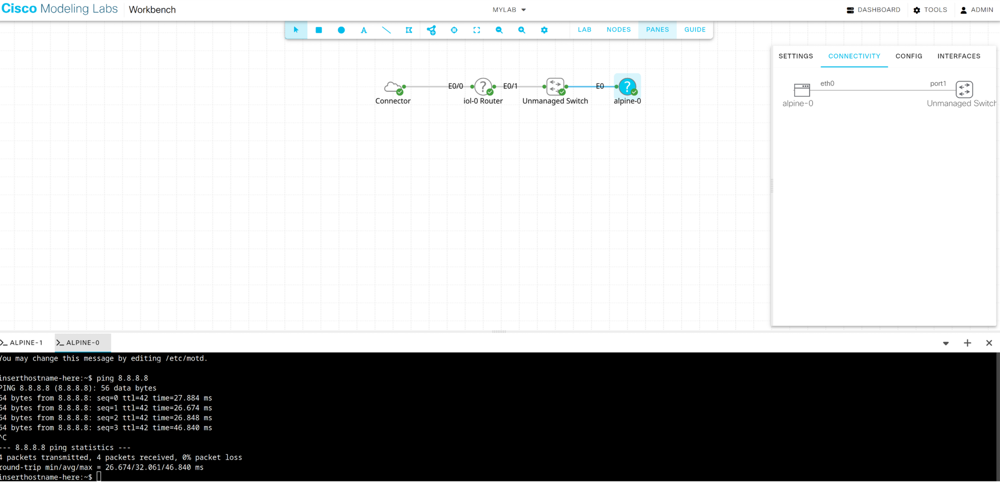

## Cisco Modeling Labs


[Back to Week 2 Overview](../../journal/week2/README.md)<br/>
[Back to Journal](../../journal/README.md)<br/>
[Back to Main](../../README.md)

What we want to do. We want to install CML2 in a hypervisor solution and set up a simple Cisco networking environment. It is recommended to use VMware Workstation.


I first tried it in a Proxmox instance in a VirtualBox environment and then in a CML2 instance on Hyper-V. Both solutions came with errors - on Proxmox the Alpine and Ubuntu instances didn't run, and on Hyper-V in Windows the External Connector didn't work.

I then finally tried it under Linux on a VMware Workstation instance, but the External Connector didn't work there either. The workaround I found was that instead of using a bridged External Connector, I tried the whole thing with a NAT External Connector and it worked.





### IOL-1 Router Config

```bash
## external interface to external nat connector 
router# configure terminal
router(config)# interface ethernet0/0
router(config-if)# ip address 192.168.255.10 255.255.255.0
router(config-if)# no shutdown
router(config-if)# exit

## internal iterface for lan 
router(config)# interface ethernet0/1
router(config-if)# ip address 192.168.2.1 255.255.255.0
router(config-if)# no shutdown
router(config-if)# exit

## default route 
router(config)# ip route 0.0.0.0 0.0.0.0 192.168.255.1

## access list for nat 
router(config)# access-list 1 permit 192.168.2.0 0.0.0.255

## configure nat 
router(config)# ip nat inside source list 1 interface ethernet0/0 overload
router(config)# interface ethernet0/0
router(config-if)# ip nat outside
router(config-if)# exit
router(config)# interface ethernet0/1
router(config-if)# ip nat inside
router(config-if)# exit

## dhcp pool 
router(config)# ip dhcp pool LAN_POOL
router(dhcp-config)# network 192.168.2.0 255.255.255.0
router(dhcp-config)# default-router 192.168.2.1
router(dhcp-config)# dns-server 8.8.8.8 8.8.4.4
router(dhcp-config)# lease 7
router(dhcp-config)# exit

## exclude dhcp adresses 
router(config)# ip dhcp excluded-address 192.168.2.1 192.168.2.100
router(config)# ip dhcp excluded-address 192.168.2.201 192.168.2.254

## enable dhcp 
router(config)# service dhcp

## save config
router(config)# exit
router# copy running-config startup-config

## testing 
router# show ip interface brief
Interface              IP-Address      OK? Method Status                Protocol
Ethernet0/0            192.168.255.12  YES NVRAM  up                    up      
Ethernet0/1            192.168.2.1     YES NVRAM  up                    up      
Ethernet0/2            unassigned      YES NVRAM  administratively down down    
Ethernet0/3            unassigned      YES NVRAM  administratively down down   

router# show ip route
router>show ip route 
Codes: L - local, C - connected, S - static, R - RIP, M - mobile, B - BGP
       D - EIGRP, EX - EIGRP external, O - OSPF, IA - OSPF inter area 
       N1 - OSPF NSSA external type 1, N2 - OSPF NSSA external type 2
       E1 - OSPF external type 1, E2 - OSPF external type 2, m - OMP
       n - NAT, Ni - NAT inside, No - NAT outside, Nd - NAT DIA
       i - IS-IS, su - IS-IS summary, L1 - IS-IS level-1, L2 - IS-IS level-2
       ia - IS-IS inter area, * - candidate default, U - per-user static route
       H - NHRP, G - NHRP registered, g - NHRP registration summary
       o - ODR, P - periodic downloaded static route, l - LISP
       a - application route
       + - replicated route, % - next hop override, p - overrides from PfR
       & - replicated local route overrides by connected

Gateway of last resort is 192.168.255.1 to network 0.0.0.0

S*    0.0.0.0/0 [1/0] via 192.168.255.1
      192.168.2.0/24 is variably subnetted, 2 subnets, 2 masks
C        192.168.2.0/24 is directly connected, Ethernet0/1
L        192.168.2.1/32 is directly connected, Ethernet0/1
      192.168.255.0/24 is variably subnetted, 2 subnets, 2 masks
C        192.168.255.0/24 is directly connected, Ethernet0/0
L        192.168.255.12/32 is directly connected, Ethernet0/0

router# ping 192.168.255.1
router# ping 8.8.8.8
router# show ip nat translations
router# show ip dhcp binding
router>sho ip dhcp bind        
Bindings from all pools not associated with VRF:
IP address      Client-ID/              Lease expiration        Type       State      Interface
                Hardware address/
                User name
192.168.2.101   0152.5400.c039.eb       Jun 18 2025 10:27 AM    Automatic  Active     Ethernet0/1
```
