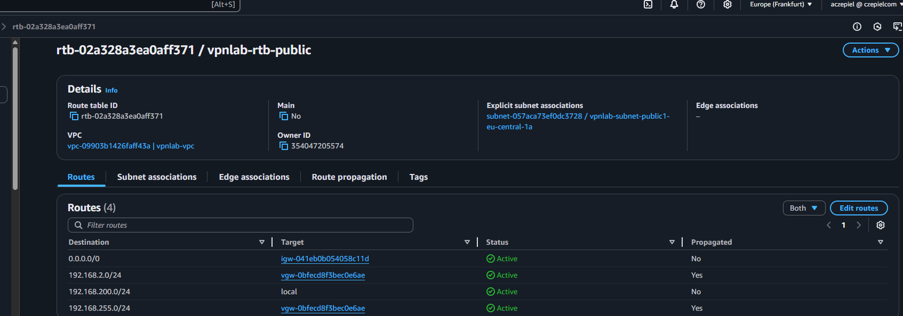

## Cisco Modeling Lab VPN

[Back to Week 2 Overview](../../journal/week2/README.md)<br/>
[Back to Journal](../../journal/README.md)<br/>
[Back to Main](../../README.md)


### Goal 

Now there is a functioning Cisco Modeling Lab with a private network 192.168.2.0/24 and a NAT network 192.168.255.0/24. Next, we want to expand the whole setup with the goal of connecting ourselves to an AWS network via Site-to-Site VPN. 


### Considerations 


### Investigation

First i need to mak3 sure my router in my homelab is configured correctly. 
```bash
## router config 
enable
configure terminal

! Hostname setzen
hostname CML-Router

! Interface zum External Connector (WAN/Internet)
interface Ethernet0/0
 description "Connection to External Connector"
 ip address dhcp
 ip nat outside
 no shutdown

! Interface zum internen Netzwerk (LAN)
interface Ethernet0/1
 description "Connection to Unmanaged Switch"
 ip address 192.168.2.1 255.255.255.0
 ip nat inside
 no shutdown

! DHCP Pool für interne Clients
ip dhcp excluded-address 192.168.2.1 192.168.2.10
ip dhcp pool LAN_POOL
 network 192.168.2.0 255.255.255.0
 default-router 192.168.2.1
 dns-server 192.168.2.1 8.8.8.8 8.8.4.4
 lease 0 12 0

! NAT Konfiguration
ip nat inside source list 1 interface Ethernet0/0 overload

! Access List für NAT
access-list 1 permit 192.168.2.0 0.0.0.255

! DNS Forwarding aktivieren
ip domain-lookup
ip name-server 8.8.8.8
ip name-server 8.8.4.4

! Default Route zum External Connector
ip route 0.0.0.0 0.0.0.0 dhcp

! Speichern der Konfiguration
exit
write memory

### vpn config 
crypto isakmp policy 200
  encryption aes 128
  authentication pre-share
  group 14
  lifetime 28800
  hash sha
exit

crypto keyring keyring-vpn-0ad24080329624b61-0
 no local-address 192.168.255.118
 local-address 192.168.255.118
 pre-shared-key address 3.78.30.29 key 1234hallo1234
exit

crypto isakmp profile isakmp-vpn-0ad24080329624b61-0
 no local-address 192.168.255.118
 local-address 192.168.255.118
 match identity address 3.78.30.29
 keyring keyring-vpn-0ad24080329624b61-0
exit

crypto ipsec transform-set ipsec-prop-vpn-0ad24080329624b61-0 esp-aes 128 esp-sha-hmac
  mode tunnel
exit

crypto ipsec profile ipsec-vpn-0ad24080329624b61-0
  set pfs group14
  set security-association lifetime seconds 3600
  set transform-set ipsec-prop-vpn-0ad24080329624b61-0
exit


crypto ipsec df-bit clear

crypto ipsec security-association replay window-size 128

crypto ipsec fragmentation before-encryption

interface Tunnel1
  ip address 169.254.30.110 255.255.255.252
  ip virtual-reassembly
  tunnel source Ethernet0/0
  tunnel destination 3.78.30.29
  tunnel mode ipsec ipv4
  tunnel protection ipsec profile ipsec-vpn-0ad24080329624b61-0
  ! This option causes the router to reduce the Maximum Segment Size of
  ! TCP packets to prevent packet fragmentation.
  ip tcp adjust-mss 1379
  no shutdown
exit

router bgp 65002
  neighbor 169.254.30.109 remote-as 64512
  neighbor 169.254.30.109 activate
  neighbor 169.254.30.109 timers 10 30 30
  address-family ipv4 unicast
    neighbor 169.254.30.109 remote-as 64512
    neighbor 169.254.30.109 timers 10 30 30
    neighbor 169.254.30.109 activate
    neighbor 169.254.30.109 soft-reconfiguration inbound
! To advertise additional prefixes to Amazon VPC, copy the 'network' statement
! and identify the prefix you wish to advertise. Make sure the prefix is present
! in the routing table of the device with a valid next-hop.
    network 192.168.2.0 mask 255.255.255.0
    network 192.168.255.0 mask 255.255.255.0
  exit
exit
```


Next step is to follow Tims aws Vpn setup instructions from the clip.

### Outcomes 

i tried several things and debugged 2 days, i tried to connect to internal network, it does not work. in aws is show that route tables are up and vpn connection is up but ping does not work, it just can ping the router at ip 192.168.255.118 and internal ip 192.168.2.1.




