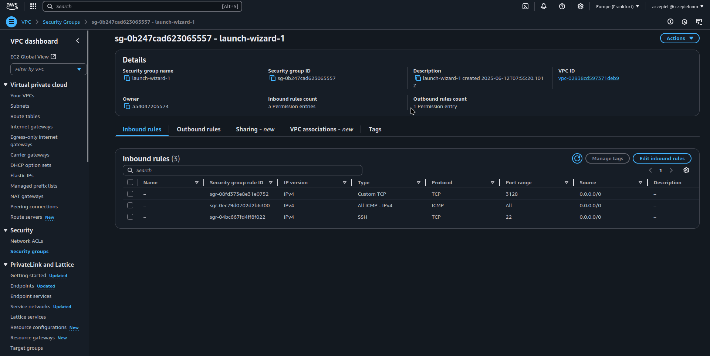

### Squid Forward Proxy

[Back to Week 2 Overview](../../journal/week2/README.md)<br/>
[Back to Journal](../../journal/README.md)<br/>
[Back to Main](../../README.md)

Today we are going to build in forward proxy system in aws with two servers, the first server is a squid proxy, the second server is a windows proxy client.the proxy should forward traffic to the windows proxy client
This is the diagram of the structure.


### Goal 

We want to see how easy or difficult it is to setup squid proxy as forward proxy with windows server via RDP.

### Considerations 

we want to find an easy solution so i decided to create a simple vpc in aws first, with public and private subnet. 


### Investigation

* aws vpv 192.168.200.0/24
    * subnet public 192.168.200.0/25
    * subnet private 192.168.200.128/25
* ubuntu instance with public ip
    * security group: 
        * allow ssh inbound 
        * allow squid proxy port 3128 inbound 
* windows server instance in private subnet
    * security group: 
        * allow RDP port 3389 inbound 
#### VPC


#### Security Group Ubuntu Proxy



#### The squid proxy configuration 

```bash
sudo apt update -y && sudo apt upgrade -y 
sudo apt install squid
sudo systemctl enable --now squid 
sudo mv /etc/squid/squid.conf /etc/squid/squid.conf.old 
nano /etc/squid/squid.conf

# /etc/squid/squid.conf

# Basic settings
http_port 3128

# Allow RDP traffic (port 3389)
acl RDP_port port 3389

# Allow your Windows server subnet (adjust as needed)
acl localnet src 10.0.0.0/8
acl localnet src 172.16.0.0/12
acl localnet src 192.168.0.0/16

# Allow target IP
acl target_server dst 192.168.200.141

# Allow RDP connections to target server
http_access allow localnet target_server RDP_port

# Allow CONNECT method for RDP
acl CONNECT method CONNECT
http_access allow CONNECT localnet target_server RDP_port

# Deny all other access
http_access deny all

### after that restart squid service 
systemctl restart squid
```

#### Configuration in local Linux machine 

```bash
[aczepiel@endeavour ~]$ ssh -i /run/media/aczepiel/Daten/DevOps/Linux/nw-bootcamp-key-endeavour.pem -L 3389:192.168.200.141:3389 ubuntu@3.70.155.222 -N &
[3] 44251
[2]   Done                    ssh -i /run/media/aczepiel/Daten/DevOps/Linux/nw-bootcamp-key-endeavour.pem -L 3389:192.168.200.9:3389 ubuntu@3.70.155.222 -N
[aczepiel@endeavour ~]$ telnet localhost 3389
Trying ::1...
Connected to localhost.
Escape character is '^]'.
^CConnection closed by foreign host.
[aczepiel@endeavour ~]$ xfreerdp3 /v:localhost:3389 /u:Administrator /cert:ignore
[10:20:06:362] [44264:0000ace9] [WARN][com.freerdp.client.x11] - [load_map_from_xkbfile]:     : keycode: 0x08 -> no RDP scancode found
[10:20:06:362] [44264:0000ace9] [WARN][com.freerdp.client.x11] - [load_map_from_xkbfile]: ZEHA: keycode: 0x5D -> no RDP scancode found
[10:20:06:372] [44264:0000ace9] [ERROR][com.freerdp.core.proxy] - [proxy_parse_uri]: Only HTTP and SOCKS5 proxies supported by now
[10:20:06:372] [44264:0000ace9] [WARN][com.freerdp.core.proxy] - [proxy_parse_uri]: Failed to parse proxy configuration: ://https:0
[10:20:06:372] [44264:0000ace9] [WARN][com.freerdp.core.proxy] - [proxy_read_environment]: Error while parsing proxy URI from environment variable; ignoring proxy
Domain:          
Password:        
[10:21:02:562] [44264:0000ace9] [ERROR][com.winpr.sspi.Kerberos] - [kerberos_AcquireCredentialsHandleA]: krb5glue_get_init_creds (Client 'Administrator@ATHENA.MIT.EDU' not found in Kerberos database [-1765328378])
[10:21:02:881] [44264:0000ace9] [ERROR][com.winpr.sspi.Kerberos] - [kerberos_AcquireCredentialsHandleA]: krb5glue_get_init_creds (Client 'Administrator@ATHENA.MIT.EDU' not found in Kerberos database [-1765328378])
[10:21:02:122] [44264:0000ace9] [WARN][com.freerdp.core.connection] - [rdp_client_connect_auto_detect]: expected messageChannelId=1008, got 1003
[10:21:02:122] [44264:0000ace9] [WARN][com.freerdp.core.license] - [license_read_binary_blob_data]: license binary blob::type BB_ERROR_BLOB, length=0, skipping.
[10:21:04:415] [44264:0000ace9] [WARN][com.freerdp.core.connection] - [rdp_client_connect_auto_detect]: expected messageChannelId=1008, got 1003
[10:21:04:432] [44264:0000ace9] [INFO][com.freerdp.gdi] - [gdi_init_ex]: Local framebuffer format  PIXEL_FORMAT_BGRX32
[10:21:04:432] [44264:0000ace9] [INFO][com.freerdp.gdi] - [gdi_init_ex]: Remote framebuffer format PIXEL_FORMAT_BGRA32
[10:21:04:439] [44264:0000ace9] [INFO][com.freerdp.channels.rdpsnd.client] - [rdpsnd_load_device_plugin]: [static] Loaded fake backend for rdpsnd
[10:21:04:439] [44264:0000ace9] [INFO][com.freerdp.channels.drdynvc.client] - [dvcman_load_addin]: Loading Dynamic Virtual Channel ainput
[10:21:04:440] [44264:0000ace9] [INFO][com.freerdp.channels.drdynvc.client] - [dvcman_load_addin]: Loading Dynamic Virtual Channel rdpgfx
[10:21:04:440] [44264:0000ace9] [INFO][com.freerdp.channels.drdynvc.client] - [dvcman_load_addin]: Loading Dynamic Virtual Channel disp
[10:21:04:440] [44264:0000ace9] [INFO][com.freerdp.channels.drdynvc.client] - [dvcman_load_addin]: Loading Dynamic Virtual Channel rdpsnd
[10:21:06:176] [44264:0000adc6] [INFO][com.freerdp.channels.rdpsnd.client] - [rdpsnd_load_device_plugin]: [dynamic] Loaded fake backend for rdpsnd
[10:21:08:725] [44264:0000ace9] [INFO][com.freerdp.client.x11] - [xf_logon_error_info]: Logon Error Info LOGON_FAILED_OTHER [LOGON_MSG_SESSION_CONTINUE]
[10:21:14:656] [44264:0000adc6] [WARN][com.freerdp.channels.drdynvc.client] - [check_open_close_receive]: {Microsoft::Windows::RDS::DisplayControl:11} OnOpen=(nil), OnClose=0x7fa80709ecc0
```

### Outcomes 

it worked well after time described how we have to set it up. I had some issues with conflicting network cause i set up the first vpn with ip cidr 192.168.100.0/24 which also is my router network range. After changing cidr in aws to 192.168.200.0/24 everything worked fine 


