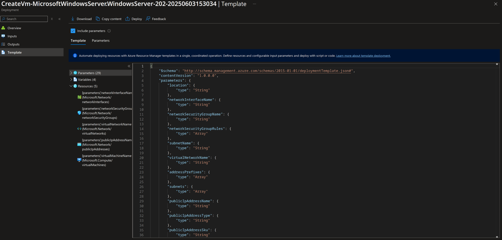

## Install Virtual Microsoft Server machine into azure with Iac like bicep / arm or terraform

[Back to Week 1 Overview](../../journal/week1/README.md) 
[Back to IP Address Management Journal](../../journal/week1/ipaddressmanagement/README.md)

At the beginning of this task i was looking for an easy solution to solve it. As azure can export the arm template after creating a vm i decided to create iac with arm templates.
I deployed the vm in azure and i downloaded the resource templates.

### Arm Templates and Claude 
* I exported both files i started to learn how to deploy arm templates, i asked claude for generating bash script which deploys and delete the azure resourceds without deleting the resource group. 
Claude AI did a good job, just a few errors with function location (executed before defined) but it solved this task. 
* also needed to modify the parameters fike cause there were parameters like secure password which i wanted for demo purpose pass as plain text while beeing insecure 
* at the end i tested the bash script and it deleted and created the virtual azure environment sucessfully
* now that it worked i created tweo entries in the makefile 
  * make deloyazure
  * make deleteazure