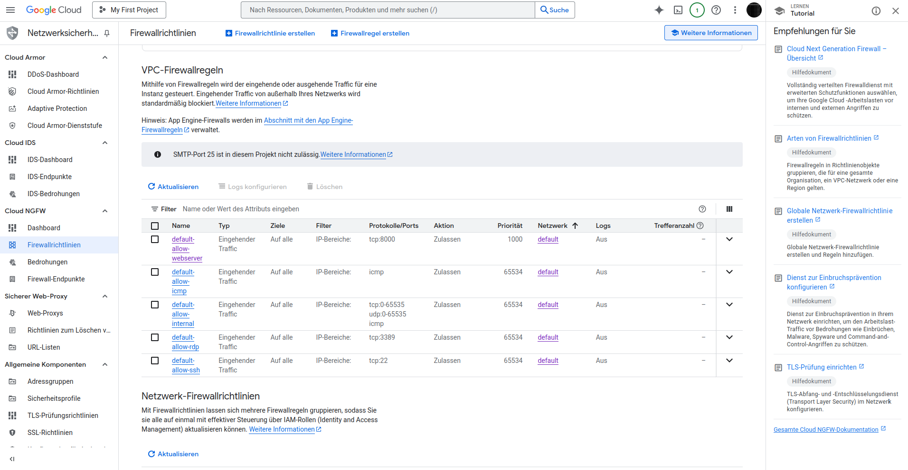
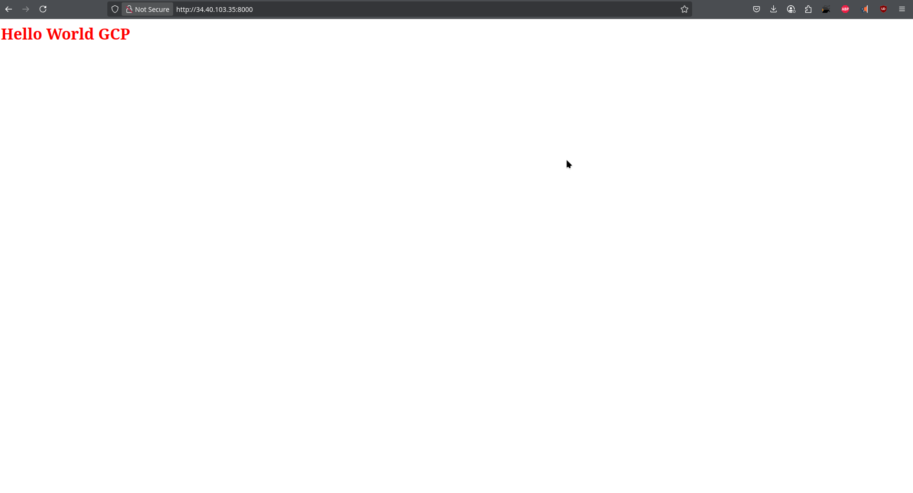
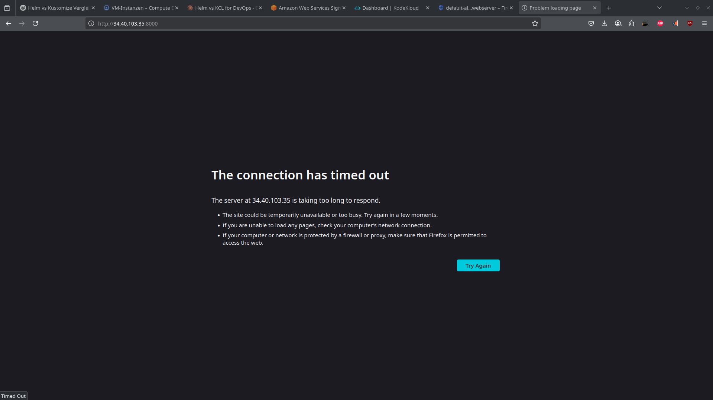

## Linux Firewall rules with gcp and iptables

[Back to Week 1 Overview](../../journal/week1/README.md)<br/>
[Back to Journal](../../journal/README.md)<br/>
[Back to Main](../../README.md)

**What we a re going to do:**

We will set up a virtual debian bookworm machine in gcp. 
We want to setup a simple webserver on port 8000 to test the iptables firewall rules in debian. Python3 is preinstalled by default so we can use module http.server.
To bring it to work we first need to configure a new firewall rule in gcp for port 8000.
After this is done we have to create a simple index.html file and start the webserver on port 8000.It now should be accessible on web.

The next test step is to block the port 8000 and start webserver on port 9000 and additionally create a redirect iptables rule to make it accessible to the gcp allow-port-8000 rule

**GCP firewall rule port 8000** 


**GCP webserver on port 8000**


** Set firewall rules**
```bash
adam_czepiel1978@my-linux-vm:~/www$ sudo iptables -A INPUT -p tcp --dport 8000 -j DROP
adam_czepiel1978@my-linux-vm:~/www$ sudo iptables-save | sudo tee /etc/iptables/rules.v4 > /dev/null 
adam_czepiel1978@my-linux-vm:~/www$ ls /etc/iptables/
rules.v4
adam_czepiel1978@my-linux-vm:~/www$ cat /etc/iptables/rules.v4 
# Generated by iptables-save v1.8.9 (nf_tables) on Sun Jun  8 23:07:45 2025
*filter
:INPUT ACCEPT [0:0]
:FORWARD ACCEPT [0:0]
:OUTPUT ACCEPT [0:0]
-A INPUT -p tcp -m tcp --dport 8000 -j DROP
COMMIT
# Completed on Sun Jun  8 23:07:45 2025
```

**Now Website with port 8000 is blocked**


**The next iptables step: block port 8000 and redirect the traffic to port 9000**
```bash
adam_czepiel1978@my-linux-vm:~/www$ sudo iptables -t nat -A PREROUTING -p tcp --dport 8000 -j REDIRECT --to-port 9000
adam_czepiel1978@my-linux-vm:~/www$ sudo iptables-save | sudo tee /etc/iptables/rules.v4 > /dev/null
adam_czepiel1978@my-linux-vm:~/www$ jobs 
[1]+  Running                 python3 -m http.server 9000 &
adam_czepiel1978@my-linux-vm:~/www$ curl http://34.40.103.35:8000
34.40.103.35 - - [08/Jun/2025 23:24:37] "GET / HTTP/1.1" 200 -
<html>
<head>
        <title>Hello World</title>
</head>
<body>
        <h1 style="color: red;">Hello World GCP</h1>
</body>
</html>
adam_czepiel1978@my-linux-vm:~/www$ cat /etc/iptables/rules.v4 
# Generated by iptables-save v1.8.9 (nf_tables) on Sun Jun  8 23:20:32 2025
*filter
:INPUT ACCEPT [194:71808]
:FORWARD ACCEPT [0:0]
:OUTPUT ACCEPT [166:17643]
-A INPUT -p tcp -m tcp --dport 8000 -j DROP
COMMIT
# Completed on Sun Jun  8 23:20:32 2025
# Generated by iptables-save v1.8.9 (nf_tables) on Sun Jun  8 23:20:32 2025
*nat
:PREROUTING ACCEPT [0:0]
:INPUT ACCEPT [0:0]
:OUTPUT ACCEPT [0:0]
:POSTROUTING ACCEPT [0:0]
-A PREROUTING -p tcp -m tcp --dport 8000 -j REDIRECT --to-ports 9000
COMMIT
# Completed on Sun Jun  8 23:20:32 2025
adam_czepiel1978@my-linux-vm:~/www$ 80.171.130.46 - - [08/Jun/2025 23:25:41] "GET / HTTP/1.1" 304 -
80.171.130.46 - - [08/Jun/2025 23:25:42] "GET / HTTP/1.1" 304 -
80.171.130.46 - - [08/Jun/2025 23:25:43] "GET / HTTP/1.1" 304 -
80.171.130.46 - - [08/Jun/2025 23:25:43] "GET / HTTP/1.1" 304 -
```

**the webserver is again accessible**


