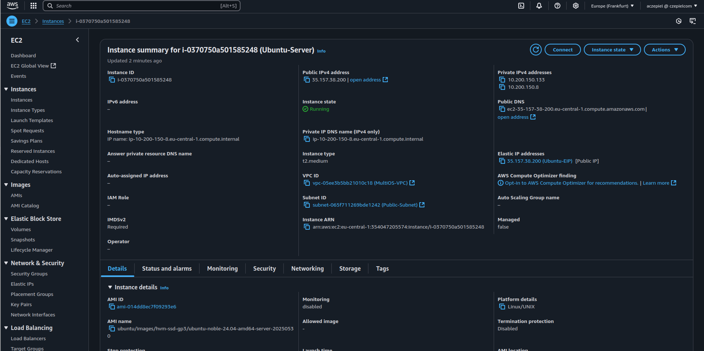

## Linux Networking 

[Back to Week 1 Overview](../../journal/week1/README.md)<br/>

### DNS Resolver 
change the DNS resolver

```bash 
# changed the /etc/systemd/resolved.conf
...
DNS=8.8.8.8
...

ubuntu@ip-10-200-150-8:~$ systemctl restart systemd-resolved.service

ubuntu@ip-10-200-150-8:~$ resolvectl status 
Global
         Protocols: -LLMNR -mDNS -DNSOverTLS DNSSEC=no/unsupported
  resolv.conf mode: stub
Current DNS Server: 8.8.8.8
       DNS Servers: 8.8.8.8

Link 2 (enX0)
    Current Scopes: DNS
         Protocols: +DefaultRoute -LLMNR -mDNS -DNSOverTLS DNSSEC=no/unsupported
Current DNS Server: 10.200.150.2
       DNS Servers: 10.200.150.2
        DNS Domain: eu-central-1.compute.internal

Link 3 (enX1)
    Current Scopes: DNS
         Protocols: +DefaultRoute -LLMNR -mDNS -DNSOverTLS DNSSEC=no/unsupported
Current DNS Server: 10.200.150.2
       DNS Servers: 10.200.150.2
        DNS Domain: eu-central-1.compute.internal

```



### WGet vs Curl 

**wget** is mostly for downloading files . It's downloader.<br>
**curl** is a tool that can send and receive data using different protocols also download. It's designed for API calls, debugging and much more.

#### curl examples with json.placeholder api
```bash
## simple query 
curl https://jsonplaceholder.typicode.com/posts | jq

## post request 
curl -X POST https://jsonplaceholder.typicode.com/posts \
  -H "Content-Type: application/json" \
  -d '{
    "title": "My New Post",
    "body": "This is the content of my post",
    "userId": 1
  }'

## response headers
curl -I https://jsonplaceholder.typicode.com/posts/1
```

## wget examples 
```bash 
# download json to file
wget -O all_posts.json https://jsonplaceholder.typicode.com/posts

# download to directory to json file
wget -P /tmp/ -O all_posts.json https://jsonplaceholder.typicode.com/posts/1
```

## Linux Firewall rules 

### Goal 

We want to see how easy or difficult it is to manage gcp and linux firewall rules.

### Considerations 

You are launching debian latest version on gcp. We aren't sure what is installed by default.

### Investigation

* iptables already was installed 
* python3 already was installed

we were able to edit the iptables through commands, direct editing iptables wasn't possible and even if it is not recommended.

we could have use ufw but we wanted to get experience with iptables since on some machines we might nit be allowed to install packages. 

### Outcomes 

We were able to open port 7000,8000 in GCP firewall rules.

We were able ti use curl with a 2 second timeout and reach the website on port 8000.

we could not combine port 8000 block and redirect 7000 to 8000 but we suspect its possible. 

It seems that iptables is easy when utilizing an AI conding agent eg, ChatGPT so there is no need for ufw firewall unless we didn't have access to an LLM and we wanted to simply use man to quickly learn how to change rules or have an easy to remember how to change rules.

