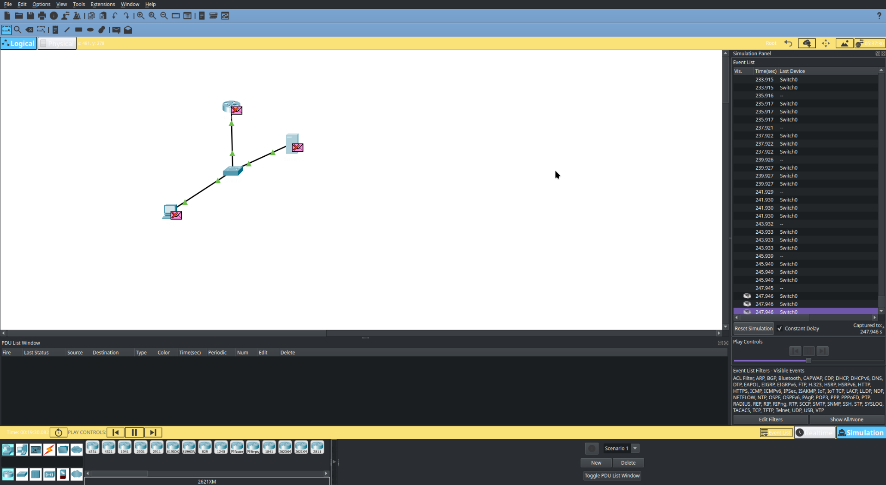

## Cisco Packet Tracer 

[Back to Week 1 Overview](../../journal/week1/README.md) 

In this chapter we explored the cisco packate tracer.

Steps: 
* Installation of packet tracer and login into account 
* Followed Tim PacketTracer video and become familiar with cisco packettracer. I am using Endeavour OS with dark color theme i ran into color style issues so i couldnt see the labels of the cisco elements like router, pc, switch.
* I have background knowledge in networking i could easily follow the clip and setup same environment as Tim.

The final result:

# Network Configuration Documentation

## Network Topology

This network consists of three main components connected in a basic star topology:

- 1x Router (Gateway)
- 1x Switch 
- 1x Server (DHCP enabled)

## IP Configuration

### Static IP Addresses

| Device | IP Address | Subnet Mask | Gateway |
|--------|------------|-------------|---------|
| Router | 192.168.0.1 | 255.255.255.0 | - |
| Server | 192.168.0.10 | 255.255.255.0 | 192.168.0.1 |

### DHCP Configuration

The server is configured as DHCP server with the following settings:

- **Pool Range:** 192.168.0.101 - 192.168.0.200
- **Subnet Mask:** 255.255.255.0
- **Default Gateway:** 192.168.0.1
- **Total Available IPs:** 100

## Device Configuration

### Router Setup

The router acts as the default gateway for the network:
- Interface IP: 192.168.0.1/24
- Provides internet access for all devices
- Routes traffic between network and external connections

### Server Setup

Server configuration includes:
- Static IP assignment: 192.168.0.10
- DHCP service enabled
- Serves IP addresses to client devices automatically
- Connected to switch port

### Switch Configuration

- All ports configured in default VLAN
- Connects router, server, and client devices
- No special configuration required
- Standard Layer 2 switching

## Network Details

**Network:** 192.168.0.0/24
**Broadcast:** 192.168.0.255  
**Available Host Range:** 192.168.0.1 - 192.168.0.254

## Client Connection

New devices connecting to the network will automatically receive:
- IP address from DHCP pool (192.168.0.101-200)
- Subnet mask: 255.255.255.0
- Gateway: 192.168.0.1

## Testing Connectivity

To verify network functionality:

1. Check if clients receive DHCP addresses
2. Test ping to gateway (192.168.0.1)
3. Test ping to server (192.168.0.10)
4. Verify internet connectivity through router

## Notes

- DHCP lease time set to default (24 hours)
- All devices in same broadcast domain
- Router handles NAT for internet access
- Switch provides connectivity between all devices
