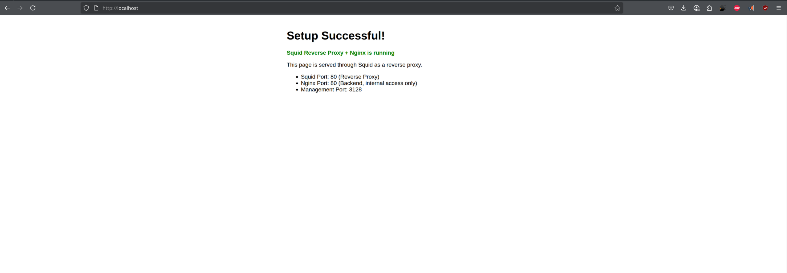

## Reverse Proxy

[Back to Week 2 Overview](../../journal/week2/README.md)<br/>
[Back to Journal](../../journal/README.md)<br/>
[Back to Main](../../README.md)

### Goal 

Our training goes on. Our next challenge is to setup a reverse proxy imn this case squid to forward traffic from proxy to a webserver. 
I decided to use docker compose for this challenge with a squid and a nginx container. 
The squid config and the index.html should be mounted.
We want to see how easy or difficult it is to setup squid proxy as reverse proxy with a webserver as target.

### Considerations 

we want to find an easy solution so i decided to use Docker as main technology

### Investigation

* squid container image exists 
* nginx container image exists 
* docker is installed 

My goal was it to mount the squid.conf and the nginx.conf as file into the related containers.

### Outcomes 

With a little help of ai squid config works excellent. 

```bash
# Minimal Squid Reverse Proxy Configuration

# HTTP Port for Reverse Proxy
http_port 80 accel defaultsite=nginx vhost

# Backend Nginx Server
cache_peer nginx parent 80 0 no-query originserver name=nginx

# Basic ACLs
acl all src all
acl localhost src 127.0.0.1/32 ::1

# Access Rules
http_access allow localhost
http_access allow all

# Cache Peer Access
cache_peer_access nginx allow all

### docker result 
[aczepiel@endeavour reverse-proxy-squid]$ docker ps 
CONTAINER ID   IMAGE                  COMMAND                  CREATED          STATUS          PORTS                                                                              NAMES
ef6c6555c3d7   ubuntu/squid:latest    "entrypoint.sh -f /e…"   32 seconds ago   Up 30 seconds   0.0.0.0:80->80/tcp, [::]:80->80/tcp, 0.0.0.0:3128->3128/tcp, [::]:3128->3128/tcp   squid-proxy
80aff63e7624   nginx:alpine           "/docker-entrypoint.…"   3 hours ago      Up 30 seconds              

```

### Result Webesite 


