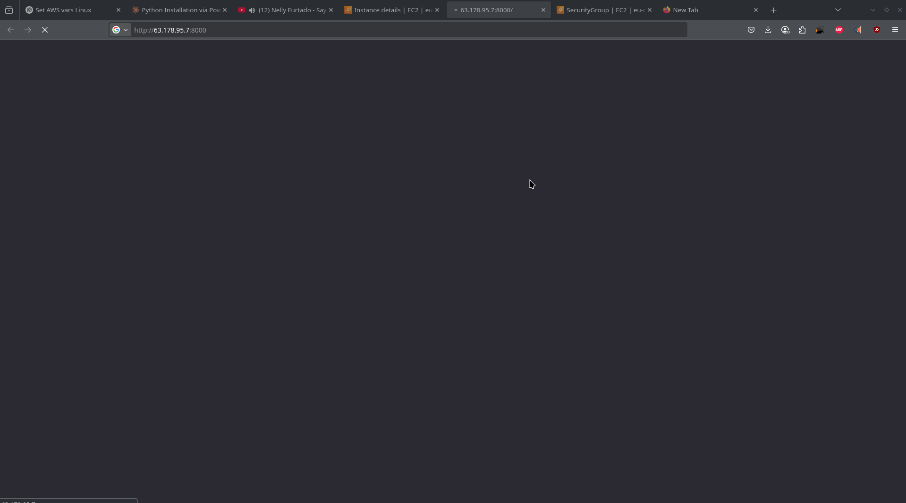
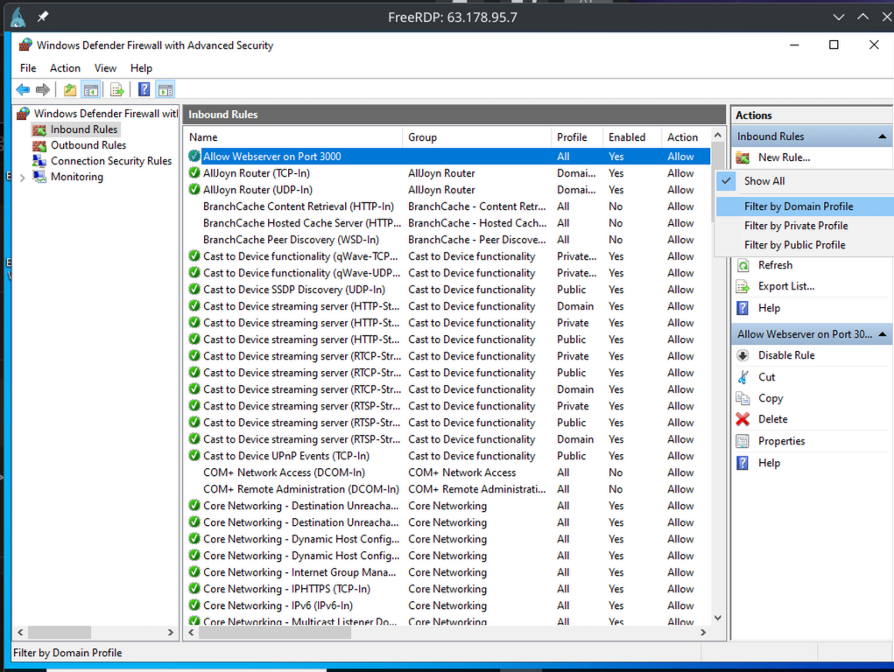
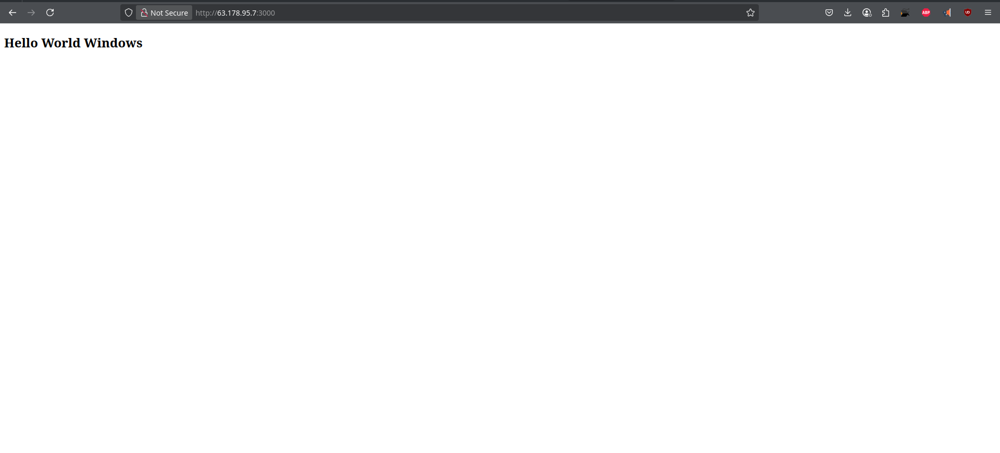

## Windows Firewall Rules 

[Back to Week 1 Overview](../../journal/week1/README.md)<br/>

### Setup http server 

```powershell
### install python 
# Download Python installer
$url = "https://www.python.org/ftp/python/3.12.0/python-3.12.0-amd64.exe"
$output = "$env:TEMP\python-installer.exe"
Invoke-WebRequest -Uri $url -OutFile $output

# Run installer silently
Start-Process -FilePath $output -ArgumentList "/quiet InstallAllUsers=1 PrependPath=1" -Wait

# Clean up
Remove-Item $output

## create websever dir and index.html file 
New-Item -ItemType Directory -Path "C:\Users\Administrator\Desktop\webserver" -Force

# Create the index.html file with the specified content
@"
<!DOCTYPE html>
<html lang="en">
<head>
<meta charset="UTF-8">
<meta name="viewport" content="width=device-width, initial-scale=1.0">
<title>Document</title>
</head>
<body>
<h2>Hello World Windows</h2>
</body>
</html>
"@ | Out-File -FilePath "C:\Users\Administrator\Desktop\webserver\index.html" -Encoding UTF8

## go to index.html path 
cd C:\Users\Administrator\Desktop\webserver

## serve website 
python -m http.server 3000
```

Existent Firewall blocks server



With new firewall rule 




