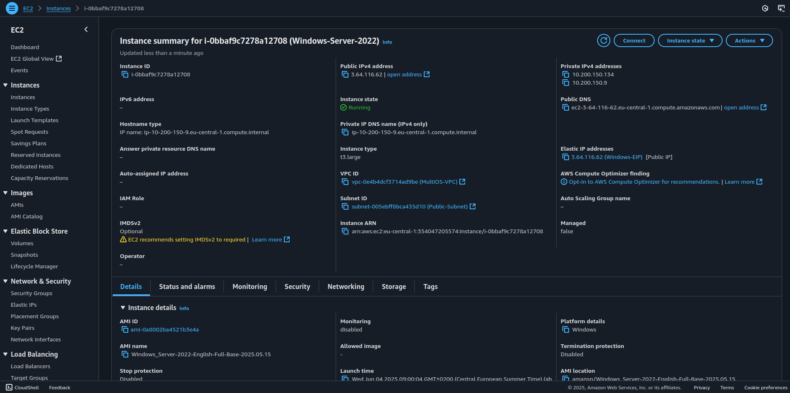

## Windows Networking 

[Back to Week 2 Overview](../../journal/week2/README.md)<br/>
[Back to Journal](../../journal/README.md)<br/>
[Back to Main](../../README.md)

## AWS Environment 



### IPConfig

```powershell
<current ip configuration>
C:\Program Files (x86)>ipconfig

Windows IP Configuration


Ethernet adapter Ethernet 3:

   Connection-specific DNS Suffix  . : eu-central-1.compute.internal
   Link-local IPv6 Address . . . . . : fe80::5b91:cbe2:277f:b524%8
   IPv4 Address. . . . . . . . . . . : 10.200.150.9
   Subnet Mask . . . . . . . . . . . : 255.255.255.240
   Default Gateway . . . . . . . . . : 10.200.150.1

Ethernet adapter Ethernet 4:

   Connection-specific DNS Suffix  . : eu-central-1.compute.internal
   Link-local IPv6 Address . . . . . : fe80::5d22:617f:fb13:1cb6%12
   IPv4 Address. . . . . . . . . . . : 10.200.150.134
   Subnet Mask . . . . . . . . . . . : 255.255.255.240
   Default Gateway . . . . . . . . . : 10.200.150.129

```

### Ping 

```powershell
# Basic ping to test connectivity
ping google.com

# Ping with specific packet count
ping -n 5 8.8.8.8

# Ping with larger packet size
ping -l 1472 google.com

# Continuous ping
ping -t 8.8.8.8
# Note: This will ping continuously until stopped

# Ping with no fragmentation
ping -f -l 1500 google.com

# IPv6 Ping:
ping -6 google.com
```

### Trace Route 


```powershell
# Basic trace route to show network path
tracert google.com

# Trace route with maximum hops limit 
tracert -h 15 microsoft.com

# Trace route without resolving hostnames (faster)
tracert -d 8.8.8.8

#  IPv6 trace route
tracert -6 google.com

# PowerShell alternative to tracert
# PowerShell Test-NetConnection for trace route
Test-NetConnection -ComputerName google.com -TraceRoute
```

### Netstat 


```powershell
# Show all active connections
netstat -a | Select-Object -First 20

# Show active TCP connections only
netstat -an | findstr TCP | Select-Object -First 10

# Show listening ports only
netstat -an | findstr LISTENING

# Show connections with process IDs
netstat -ano

# Show network statistics
netstat -s 

# Show routing table using netstat
netstat -r

# Show connections for specific port
netstat -an | findstr :80

# Continuous monitoring (refresh every 5 seconds)
netstat -an 5

# PowerShell Get-NetTCPConnection (modern alternative)
Write-Host "Command: Get-NetTCPConnection | Where-Object State -eq 'Listen'" -ForegroundColor Gray
Get-NetTCPConnection | Where-Object State -eq 'Listen' | Select-Object LocalAddress, LocalPort, State | Format-Table

# PowerShell Get-NetUDPEndpoint
Get-NetUDPEndpoint | Select-Object LocalAddress, LocalPort | Format-Table -AutoSize
```

### Route 


```powershell
# Display current routing table
route print

# Display IPv4 routing table only

route print -4

# Display IPv6 routing table only
route print -6

# Add a static route
route add 192.168.100.0 mask 255.255.255.0 192.168.1.1 IF 4 

# Add a persistent static route
route -p add 192.168.100.0 mask 255.255.255.0 192.168.1.1

# Delete a route
route delete 192.168.100.0 if 4

# Change an existing route
route change 192.168.100.0 mask 255.255.255.0 192.168.1.2 if 4

# PowerShell Get-NetRoute (modern alternative)
Get-NetRoute -AddressFamily IPv4 | Where-Object DestinationPrefix -ne "224.0.0.0/4" | 
    Select-Object DestinationPrefix, NextHop, InterfaceAlias, RouteMetric | 
    Format-Table -AutoSize

# PowerShell New-NetRoute (add route
New-NetRoute -DestinationPrefix '192.168.100.0/24' -NextHop '192.168.1.1'

# PowerShell Remove-NetRoute (delete route)
Remove-NetRoute -DestinationPrefix '192.168.100.0/24'
```

